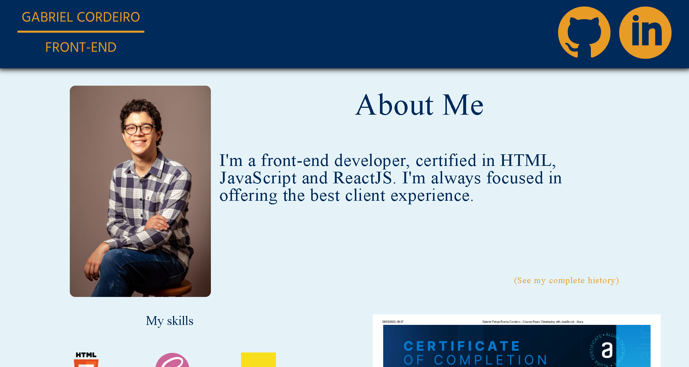

# 💻 Front-End Portifolio

## 👀 Check the project [here](https://gabrielfrcordeiro.github.io/portifolio/index.html)

## 🤓 About the project
- Presentation portifolio website
- Social media for contact
- Brief introduction of mine
- My full history with programming
- My skills and certificates
- Contact Me section

## 🔧 Tecnologies used

## 🧮 Front-End concepts used
- Semantic HTML
- Accessibility
- Mobile-first
- Responsive design

## 📚 Author

<table>
  <tr>
    <td align="center">
      <a href="https://github.com/GabrielFRCordeiro">
         
        
          <b>Gabriel Cordeiro</b>
        
      </a>
    </td>
  </tr>
</table>

## 💼 License
[GNU General Public License v2.0](./LICENSE)
